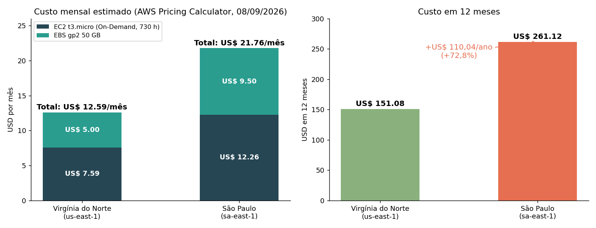
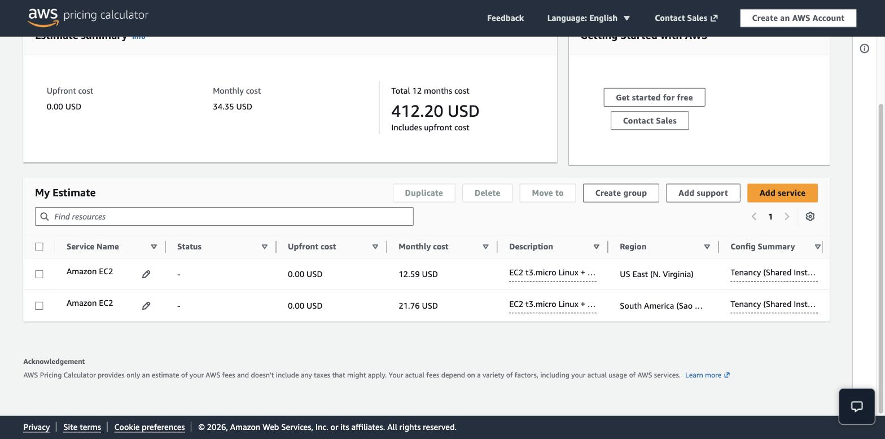
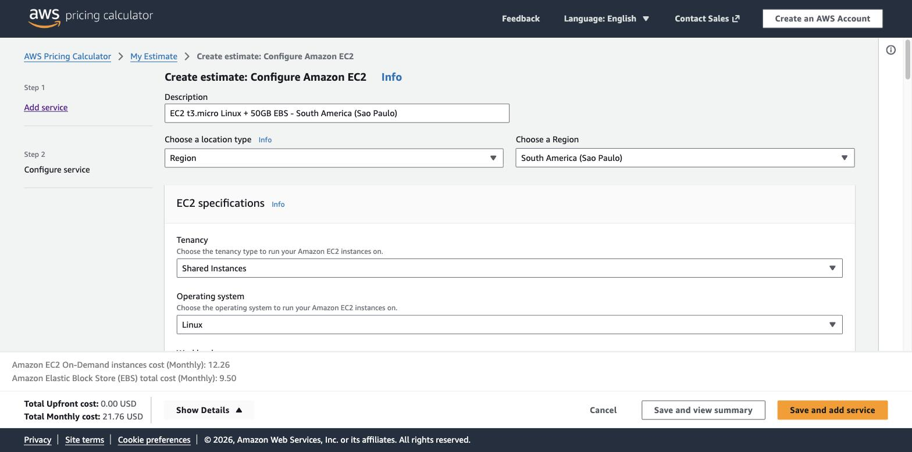
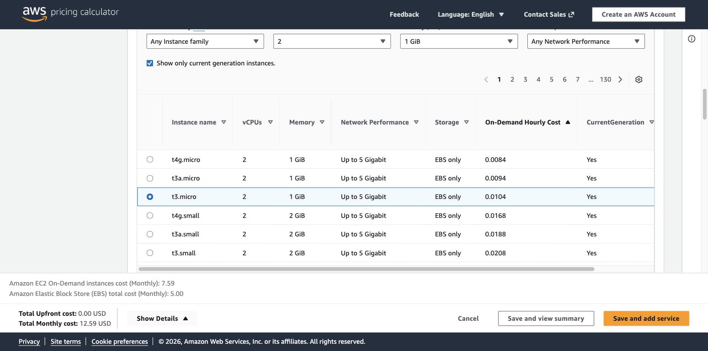
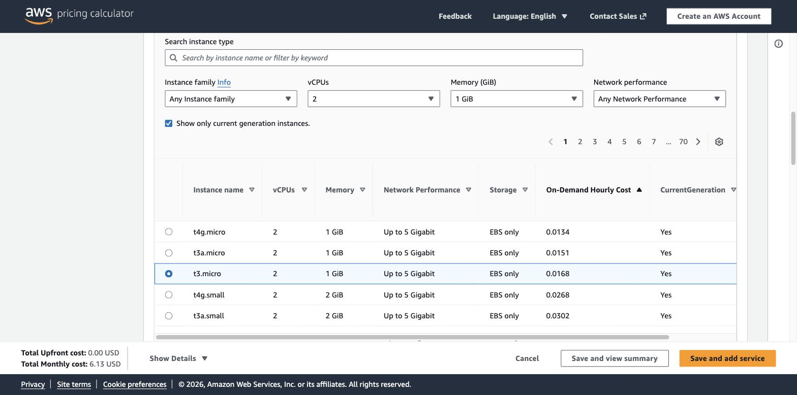
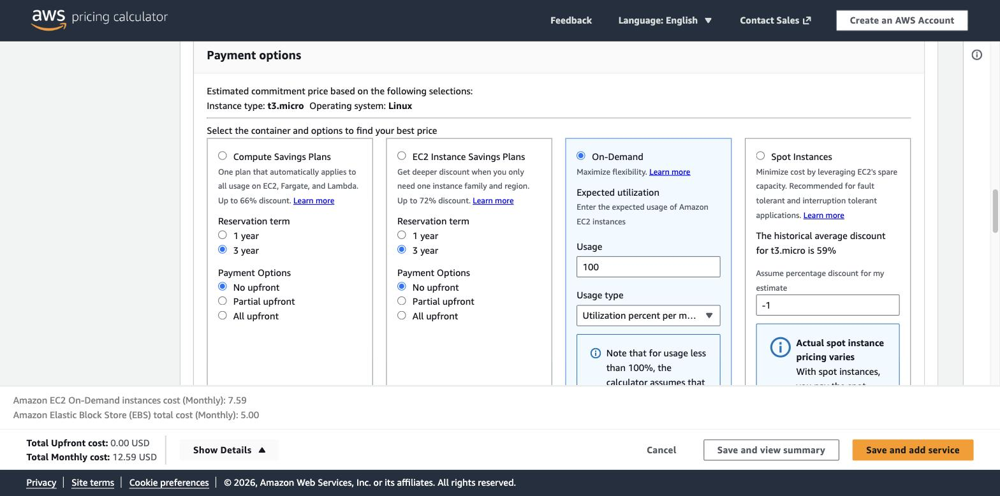
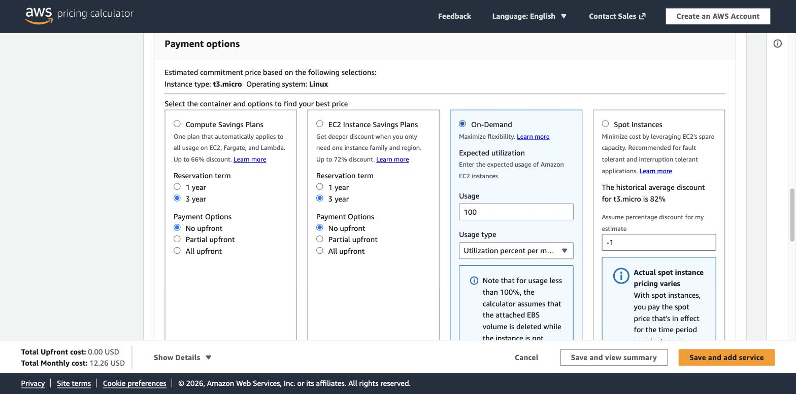
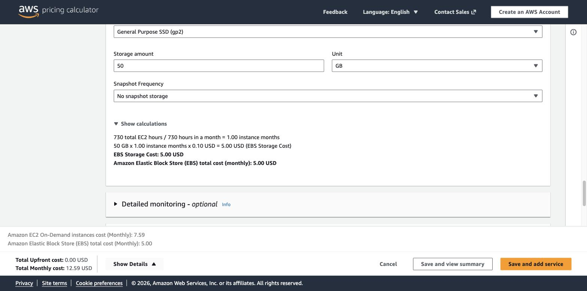
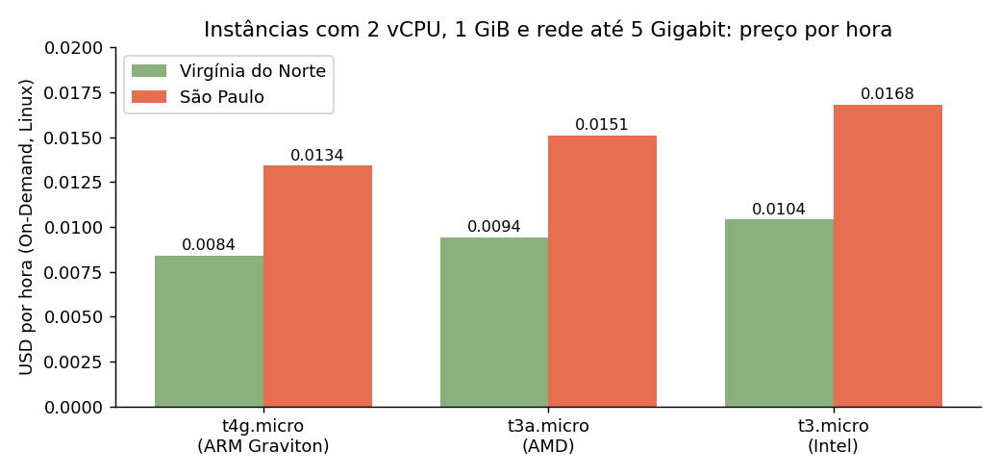

# FIAP - Faculdade de Informática e Administração Paulista

<p align="center">
<a href="https://www.fiap.com.br/"></a>
</p>

<br>

# FarmTech Solutions | Fase 5: Machine Learning na Cabeça

## Grupo 48

## 👨‍🎓 Integrantes:
- <a href="https://www.linkedin.com/in/williandocarmo-ai/">Willian Kauê Tobias do Carmo (RM 570038)</a>

## 👩‍🏫 Professores:
### Tutor(a)
- <a href="https://github.com/SabrinaOtoni">Sabrina Otoni</a>
### Coordenador(a)
- <a href="https://github.com/agodoi">André Godoi Chiovato</a>

## 📜 Descrição

A **FarmTech Solutions** presta serviços de IA para uma fazenda de médio porte (200 hectares) que produz quatro culturas: cacau, dendê (óleo de palma), arroz e borracha natural. Nesta fase o projeto tem duas entregas obrigatórias:

**Entrega 1 (Machine Learning):** a partir da base `crop_yield.csv` (156 registros com precipitação, umidade específica, umidade relativa, temperatura e rendimento por cultura), realizamos a análise exploratória, buscamos tendências de produtividade por meio de clusterização (K-Means, agrupamento hierárquico e PCA), investigamos cenários discrepantes (IQR, z-score, Isolation Forest e DBSCAN) e treinamos **cinco modelos preditivos de regressão** com algoritmos distintos (Regressão Linear, Árvore de Decisão, Random Forest, Gradient Boosting e SVR) para prever o rendimento da safra a partir das condições climáticas. Todo o passo a passo, o código comentado, os gráficos, os achados e a discussão de pontos fortes e limitações estão no notebook Jupyter:

➡️ **[`src/WillianKaueTobiasDoCarmo_rm570038_pbl_fase4.ipynb`](src/WillianKaueTobiasDoCarmo_rm570038_pbl_fase4.ipynb)** (executado, com todas as saídas salvas)

> Nota sobre o nome do arquivo: o enunciado pede que o nome contenha o nome completo, o RM e o sufixo `pbl_fase4.ipynb`; seguimos a instrução literalmente.

Em resumo, o notebook mostra que a base descreve **39 cenários climáticos observados para as 4 culturas** em uma mesma localidade; que existem **três regimes climáticos** cujo efeito sobre a produtividade muda de sinal conforme a cultura (o regime quente favorece o arroz e penaliza a borracha; o regime seco e mais fresco faz o oposto); que **não há outliers de rendimento**, apenas anos climáticos extremos; e que, entre os cinco algoritmos, os modelos de árvore (em especial o **Random Forest**) são os únicos que superam de forma consistente o baseline de "média da cultura", com erro percentual médio de 11,3% em cenários nunca vistos. O notebook também discute com transparência a principal limitação da base: uma tendência temporal (tecnológica) que as variáveis climáticas não capturam.

🎬 **Vídeo da Entrega 1 (até 5 min, YouTube não listado):** [https://youtu.be/V7hdmooedbM](https://youtu.be/V7hdmooedbM)

**Entrega 2 (Computação em Nuvem):** estimativa de custos na AWS Pricing Calculator para hospedar a API que receberá os dados dos sensores e executará o modelo, comparando as regiões São Paulo e Virgínia do Norte, com a justificativa técnica da escolha. Está documentada na seção [Entrega 2](#entrega-2) deste README.

🎬 **Vídeo da Entrega 2 (até 5 min, YouTube não listado):** [https://youtu.be/EQDMDb9ZT5s](https://youtu.be/EQDMDb9ZT5s)

---

<a name="entrega-2"></a>
## ☁️ Entrega 2: estimativa de custos na AWS e escolha da região

### Cenário
A API da FarmTech receberá os dados dos sensores (precipitação, umidade, temperatura) e executará o modelo de Machine Learning. A máquina Linux pedida no enunciado tem a seguinte configuração:

| Requisito | Valor exigido | Como foi atendido na calculadora |
|---|---|---|
| CPU | 2 vCPUs | Instância **t3.micro** (2 vCPU) |
| Memória | 1 GiB | t3.micro (1 GiB) |
| Rede | até 5 Gigabit | t3.micro ("Up to 5 Gigabit") |
| Armazenamento | 50 GB | Amazon EBS General Purpose SSD (gp2), 50 GB, sem snapshots |
| Sistema operacional | Linux simples | Linux, Shared Instances |
| Modelo de cobrança | On-Demand, 100% | Pricing strategy On-Demand, Utilization 100%/mês (730 h) |

Cotação realizada em **08/09/2026** na [AWS Pricing Calculator](https://calculator.aws/#/), 1 instância, sem transferência de dados e sem impostos (aviso padrão da calculadora). Os prints de cada etapa estão em [`assets/aws/`](assets/aws/).

> Interpretação do requisito "50 GB de armazenamento (HD)": usamos o volume **Amazon EBS General Purpose SSD (gp2)**, padrão da calculadora e o tipo adequado para hospedar uma API. A calculadora também oferece gp3 (US$ 4,00 em Virgínia e US$ 7,60 em São Paulo para 50 GB) e o volume magnético legado (`standard`), não recomendado para cargas de aplicação; a comparação entre regiões não muda com a escolha do tipo de volume.

### 1) Comparação de custos: São Paulo x Virgínia do Norte

| Item | US East (N. Virginia) `us-east-1` | South America (São Paulo) `sa-east-1` | Diferença |
|---|---|---|---|
| Preço por hora da t3.micro (On-Demand, Linux) | US$ 0,0104 | US$ 0,0168 | +61,5% |
| EC2 (1 × preço/h × 730 h) | **US$ 7,59/mês** | **US$ 12,26/mês** | +US$ 4,67 |
| EBS gp2 50 GB (US$/GB-mês: 0,10 vs 0,19) | **US$ 5,00/mês** | **US$ 9,50/mês** | +US$ 4,50 (+90%) |
| **Total mensal** | **US$ 12,59** | **US$ 21,76** | **+US$ 9,17 (+72,8%)** |
| **Total em 12 meses** | **US$ 151,08** | **US$ 261,12** | **+US$ 110,04** |
| Custo inicial (upfront) | US$ 0,00 | US$ 0,00 | - |

<p align="center"></p>

<p align="center"><br><em>Tela "My Estimate" da calculadora com os dois serviços salvos: US$ 12,59/mês (Virgínia) e US$ 21,76/mês (São Paulo).</em></p>

<details>
<summary><strong>Ver prints detalhados da configuração (clique para expandir)</strong></summary>

| Virgínia do Norte | São Paulo |
|---|---|
|  |  |
|  |  |
|  |  |
|  |  |

</details>

**Resposta à pergunta 1 (qual a solução mais barata?):** com a configuração exigida, a região **Virgínia do Norte (us-east-1)** é a mais barata: **US$ 12,59/mês** contra **US$ 21,76/mês** em São Paulo. A diferença de US$ 9,17/mês (US$ 110,04/ano) vem tanto da instância (+61,5%) quanto do armazenamento EBS (+90%): a região de São Paulo tem, historicamente, os preços mais altos da AWS nas Américas por causa de custos locais de infraestrutura, energia e tributação.

Observação complementar: a calculadora mostra outras instâncias com exatamente a mesma especificação (2 vCPU, 1 GiB, até 5 Gigabit) e preço menor, úteis para otimizar custo dentro da região escolhida.

<p align="center"></p>

| Instância (2 vCPU, 1 GiB, até 5 Gigabit) | Virgínia do Norte (US$/h) | São Paulo (US$/h) |
|---|---|---|
| t3.micro (Intel, cotada) | 0,0104 | 0,0168 |
| t3a.micro (AMD) | 0,0094 | 0,0151 |
| t4g.micro (ARM Graviton) | 0,0084 | 0,0134 |

### 2) Acesso rápido aos dados e restrições legais: qual região escolher?

**Escolha: South America (São Paulo), `sa-east-1`.** Mesmo sendo 72,8% mais cara, é a única opção que atende simultaneamente aos dois requisitos do cenário.

**a) Restrições legais para armazenamento no exterior (requisito eliminatório).** Se há restrição legal ou contratual a armazenar os dados fora do Brasil, hospedar a API e o disco EBS na Virgínia do Norte significa persistir os dados em território norte-americano, ou seja, descumprir a restrição. No Brasil, a **LGPD (Lei nº 13.709/2018)** trata a transferência internacional de dados pessoais como exceção condicionada (art. 33), e a fazenda pode ter dados pessoais associados aos sensores e à operação (geolocalização de talhões e propriedades, dados de funcionários, contratos). Além disso, contratos com clientes do agronegócio e políticas de soberania de dados frequentemente exigem **residência dos dados no país**. Descumprir essas regras expõe a FarmTech a sanções (a LGPD prevê multa de até 2% do faturamento, limitada a R$ 50 milhões por infração, art. 52) e a risco reputacional. Nenhuma economia de US$ 110 por ano compensa esse risco.

**b) Acesso rápido aos dados dos sensores (desempenho).** Os sensores estão no Brasil. Uma API em São Paulo responde com latência de rede de poucos milissegundos a algumas dezenas de milissegundos; para a Virgínia do Norte, o tempo de ida e volta Brasil-EUA costuma ficar na faixa de 120 a 150 ms, a cada requisição. Para ingestão contínua de leituras e para respostas do modelo em tempo quase real (alertas de irrigação, por exemplo), a região local reduz latência, perda de pacotes e variação de resposta (jitter), além de simplificar a integração com outros serviços que precisarão ficar no Brasil pelo mesmo motivo legal (banco de dados, backups).

**c) Viabilidade econômica.** O custo absoluto é baixo nas duas regiões: a diferença é de US$ 9,17 por mês para uma fazenda de 200 hectares. Dentro de São Paulo ainda é possível reduzir o valor sem descumprir nenhum requisito: usar a **t4g.micro (Graviton)** com a mesma especificação cai o custo da instância para US$ 9,78/mês (-20%), trocar o EBS gp2 por **gp3** reduz o armazenamento para US$ 7,60/mês, e, quando a carga estiver estável, um plano **Savings Plan/Reserved** de 1 ou 3 anos reduz o custo da instância em mais 30 a 60%. Ou seja, o "prêmio regional" de São Paulo é facilmente absorvido por otimizações de arquitetura.

**d) Quando a Virgínia do Norte faria sentido.** Apenas se não houvesse restrição legal de residência e a carga fosse assíncrona (processamento em lote noturno, treinamento de modelos), situação em que a latência importa pouco e o preço menor pesa mais. Não é o caso do cenário proposto.

**Conclusão da Entrega 2:** a solução **mais barata** é a Virgínia do Norte (US$ 12,59/mês), mas a solução **adequada** ao cenário da FarmTech é **São Paulo (US$ 21,76/mês)**: conformidade legal é requisito eliminatório, a latência local melhora a experiência com os sensores em tempo real e a diferença de custo é pequena e otimizável. Em decisões de arquitetura em nuvem, o custo é uma das variáveis, não a única.

🎬 **Vídeo da Entrega 2 (até 5 min, YouTube não listado):** [https://youtu.be/EQDMDb9ZT5s](https://youtu.be/EQDMDb9ZT5s)

---

## 📁 Estrutura de pastas

Dentre os arquivos e pastas presentes na raiz do projeto, definem-se:

- <b>.github</b>: arquivos de configuração específicos do GitHub.
- <b>assets</b>: elementos não estruturados do repositório: o dataset `crop_yield.csv`, os gráficos gerados para este README e, em `assets/aws/`, os prints da AWS Pricing Calculator.
- <b>config</b>: arquivos de configuração do projeto (nesta fase, não utilizados).
- <b>document</b>: documentos do projeto: o PDF de entrega enviado no portal FIAP (`document/entrega_portal_fase5.pdf`). Em `document/other/` estão materiais complementares.
- <b>scripts</b>: scripts auxiliares (nesta fase, não utilizados).
- <b>src</b>: código-fonte da Fase 5: o notebook Jupyter da Entrega 1 e o `requirements.txt` com as dependências.
- <b>README.md</b>: este arquivo, que serve como guia e explicação geral sobre o projeto e contém a Entrega 2.

## 🔧 Como executar o código

**Pré-requisitos:** Python 3.10 ou superior e Jupyter (Notebook, Lab ou VS Code). As versões usadas na execução original estão registradas na primeira célula do notebook e em `src/requirements.txt` (pandas, numpy, scikit-learn, matplotlib, seaborn, scipy).

```bash
# 1) Clonar o repositório
git clone https://github.com/willktdc/fiap-ia-fase5-farmtech-grupo48.git
cd fiap-ia-fase5-farmtech-grupo48

# 2) (Opcional) criar um ambiente virtual
python -m venv .venv && source .venv/bin/activate      # Windows: .venv\Scripts\activate

# 3) Instalar as dependências
pip install -r src/requirements.txt

# 4) Abrir e executar o notebook (Kernel > Restart & Run All)
jupyter notebook src/WillianKaueTobiasDoCarmo_rm570038_pbl_fase4.ipynb
```

O notebook lê o dataset por caminho relativo (`../assets/crop_yield.csv`, ou `assets/crop_yield.csv` quando executado da raiz). No **Google Colab**, basta fazer upload do notebook: ele tenta automaticamente o arquivo *raw* deste repositório como alternativa. A execução completa leva menos de 1 minuto em um computador comum.

## 🗃 Histórico de lançamentos

* 0.5.0 - 08/09/2026
    * Fase 5: notebook de Machine Learning (EDA, outliers, clusterização e 5 modelos de regressão), estimativa de custos AWS (São Paulo x Virgínia do Norte) e justificativa técnica da região.

## 📋 Licença

<p xmlns:cc="http://creativecommons.org/ns#" xmlns:dct="http://purl.org/dc/terms/"><a property="dct:title" rel="cc:attributionURL" href="https://github.com/agodoi/template">MODELO GIT FIAP</a> por <a rel="cc:attributionURL dct:creator" property="cc:attributionName" href="https://fiap.com.br">Fiap</a> está licenciado sobre <a href="http://creativecommons.org/licenses/by/4.0/?ref=chooser-v1" target="_blank" rel="license noopener noreferrer" style="display:inline-block;">Attribution 4.0 International</a>.</p>
